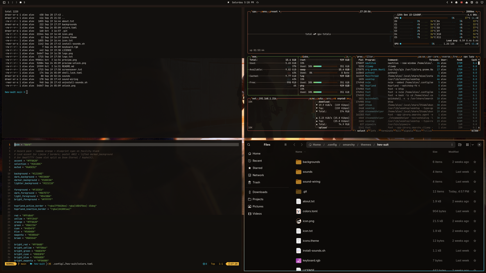

# HEV Suit — Omarchy theme

Incident report, unclassified: Freeman never clocked in for the usual Tuesday.
Somewhere between the tram ride and the HEV bay the facility stood up a
compositor called **Hyprland**, an opinionated Arch called **Omarchy**, and a
terminal that answered in hazard orange. The resonance cascade still happened
— of course it did — but the desktop held. Facility black. Blueprint cyan on
the monitors. Active Hypr borders run a 45° **HEV-orange → blueprint-cyan**
gradient (same dual-accent trick as Asphalt, Galuga, CS, Cyber Shadow, Doom 2016, Eternal, Caged, KI, Rising, Stanley, SF6, T2D & USFIV). And the suit
got into the system: boot, low power, updates, wrong unlock — a lite patch of
GothLady HEV lines on the desktop. Full voice still lives in *Black Mesa* for
anyone who owns the game; some workshop notes say they could listen to her
all day. Fair. Same story, better rice.

Orange-suit theme for [Omarchy](https://omarchy.org/). Inspired by the look of
*Black Mesa* / *Half-Life* — **not affiliated with Valve or Crowbar Collective**
(see [Credits](#credits--legal-ish) below).

Adjacent, different vibe:
[Shiver-dev01/omarchy-black-mesa-theme](https://github.com/Shiver-dev01/omarchy-black-mesa-theme)
is an **amber phosphor CRT** “Black Mesa” take (single facility-amber accent,
scanline wallpapers). This pack is the *game* — HEV orange, blueprint cyan,
Steam art, corridor zombies and all. Same building, different wing.

Omarchy derives the install folder from the repo name (`omarchy-…-theme` →
slug). A plain `black-mesa` slug would collide with that CRT pack — `theme
install` **deletes** the existing folder first — so this one ships as **HEV
Suit** (`omarchy-hev-suit-theme` → `hev-suit`) and they can coexist.

<p align="center">
  
</p>




Also in this series:
[Asphalt Legends](https://github.com/AlxWolfenstein97/omarchy-asphalt-legends-theme),
[Operation Galuga](https://github.com/AlxWolfenstein97/omarchy-operation-galuga-theme),
[Counter-Strike](https://github.com/AlxWolfenstein97/omarchy-counter-strike-theme),
[Cyber Shadow](https://github.com/AlxWolfenstein97/omarchy-cyber-shadow-theme),
[Doom 2016](https://github.com/AlxWolfenstein97/omarchy-doom-2016-theme),
[Doom Eternal](https://github.com/AlxWolfenstein97/omarchy-doom-eternal-theme),
[Half-Life Caged](https://github.com/AlxWolfenstein97/omarchy-half-life-caged-theme),
[Killer Instinct](https://github.com/AlxWolfenstein97/omarchy-killer-instinct-theme),
[Metal Gear Rising](https://github.com/AlxWolfenstein97/omarchy-metal-gear-rising-theme),
[Stanley Parable](https://github.com/AlxWolfenstein97/omarchy-stanley-parable-theme),
[Street Fighter 6](https://github.com/AlxWolfenstein97/omarchy-street-fighter-6-theme),
[Terminator 2D: NO FATE](https://github.com/AlxWolfenstein97/omarchy-terminator-2d-no-fate-theme),
and
[Ultra Street Fighter IV](https://github.com/AlxWolfenstein97/omarchy-ultra-street-fighter-iv-theme).

## Install

```bash
omarchy theme install https://github.com/AlxWolfenstein97/omarchy-hev-suit-theme.git
# optional — About + screensaver ASCII for this theme (skippable; see Branding)
cp ~/.config/omarchy/themes/hev-suit/about.txt ~/.config/omarchy/branding/about.txt
cp ~/.config/omarchy/themes/hev-suit/screensaver.txt ~/.config/omarchy/branding/screensaver.txt
```

That clones **and** applies the theme (`omarchy-theme-set` runs inside
`theme install`). Do **not** follow with another `omarchy theme set` — a second
set skips the first wallpaper and just wastes a switch.

Or clone into place (then you *do* need an explicit set):

```bash
git clone https://github.com/AlxWolfenstein97/omarchy-hev-suit-theme.git ~/.config/omarchy/themes/hev-suit
omarchy theme set "HEV Suit"
# optional branding — same as above
cp ~/.config/omarchy/themes/hev-suit/about.txt ~/.config/omarchy/branding/about.txt
cp ~/.config/omarchy/themes/hev-suit/screensaver.txt ~/.config/omarchy/branding/screensaver.txt
```

Already installed and just switching back later:

```bash
omarchy theme set "HEV Suit"
# optional — re-apply this theme’s About / screensaver marks
cp ~/.config/omarchy/themes/hev-suit/about.txt ~/.config/omarchy/branding/about.txt
cp ~/.config/omarchy/themes/hev-suit/screensaver.txt ~/.config/omarchy/branding/screensaver.txt
```

Cycle wallpapers with `omarchy theme bg next`.

## What’s in the pack

| Asset | Role |
|-------|------|
| `colors.toml` | Palette (the real theme) |
| `backgrounds/` | Wallpapers |
| `sounds/` | Four GothLady HEV cues — optional wiring via `install-sounds.sh` / `uninstall-sounds.sh` (see [How HEV system sounds work](#how-hev-system-sounds-work)) |
| `unlock.png` / `preview-unlock.png` | Plymouth unlock + picker mockup |
| `preview.png` | Theme switcher preview |
| `icon.txt` / `logo.txt` (+ `about.txt` / `screensaver.txt`) | About & screensaver **ASCII** branding |
| `icon.png` / `logo.png` | Same marks as images (README + optional “Set From Image”) |

### Branding (About / screensaver)

**Optional.** Omarchy’s About screen and screensaver read from
`~/.config/omarchy/branding/`. Shipping per-theme `.txt` marks isn’t original —
other Omarchy 3.x themes did it — but it’s the fast path if you want *this*
pack’s wordmark on idle and on About without hunting files.

**Prefer the `.txt` files** and the `cp` lines in [Install](#install). That’s
what you’re meant to see. Editing the text also works (Style → About /
Screensaver → Edit Text).

**Skip the `cp` if you already have custom logos / screensaver art you care
about** — or back those up first. The branding slot is really meant for *your*
marks (put personal art somewhere easy to reach). The Style file picker works,
but drilling into `~/.config/omarchy/themes/...` is slow busywork for something
optional. Don’t feel obliged to bring mine.

The `.png` versions are here for the README and for a quick Style → **Set From
Image** try. In my experience Omarchy’s image→ASCII path is a bit thinicky on
color and boxing, so don’t expect magic from the PNGs — the hand text is the
good path.

### Unlock

Style → Unlock → pick this theme (`unlock.png` / `preview-unlock.png`).

## How HEV system sounds work

Extra for **this** theme — same spirit as the plugin extenders below: palette +
art ship by default; the VO is optional desktop wiring you opt into once.
Other themes stay quiet because the dispatcher only plays files from the
*current* theme’s `sounds/` folder.

Lovingly voiced by **Kerensa “Goth_Lady1987” Hayes**, chopped / shipped here by
**Alex_Wolfenstein97**. Full pack on Steam Workshop:
[GothLady’s HEV Suit Voice](https://steamcommunity.com/sharedfiles/filedetails/?id=2877289836).
This theme is a **lite** pack — four desktop cues. There’s a whole lot more of
her if you own *Black Mesa*. If you don’t… why are you even here?

| File | Line | Trigger |
|------|------|---------|
| `sounds/login.ogg` | Welcome + vitals OK (welcome bits trimmed) | Desktop start |
| `sounds/battery.ogg` | Warning: vital signs critical | Low battery (≤10%, discharging) |
| `sounds/update.ogg` | Power restored | After `omarchy update` finishes (see below) |
| `sounds/denied.ogg` | Warning: biohazard detected | Wrong password on the lock screen |

Levels are the edited export as-is (mean roughly **−15 to −18 dB**) — clear
over quiet lofi / NCS / Omarchy Radio, not fighting a cliamp stream at 0 dB,
and nowhere near the clipped in-game original HEV blast.

### Exactly how each cue fires

1. **Login** — Hyprland’s stock autostart runs
   `sleep 2 && omarchy-hook post-boot` after the desktop comes up. That hook
   directory runs `omarchy-sound login`, which `paplay`s
   `~/.local/state/omarchy/current/theme/sounds/login.ogg` if present.
2. **Battery** — Omarchy’s battery service polls every 30s (and on AC changes).
   When you’re on battery, discharging, at or below **10%**, and haven’t been
   notified yet this discharge cycle, it runs `omarchy-battery-low`, which
   fires the `battery-low` hooks → `omarchy-sound battery`.
3. **Update** — stock Omarchy calls `omarchy-hook post-update` **mid-pipeline**:
   after system packages + migrations, **before** AUR, mise, and orphan
   cleanup. Official docs say the same (“after system packages and
   migrations”). The floating “Done — press any key” prompt
   (`omarchy-show-done`) only appears **after** the whole `omarchy-update`
   process exits — much later. Snapshot creation still runs up front even on
   a no-op / “joke” update (same reason Omarchy always snapshots before
   touching pkgs). There is no later hook we can use.

   So this theme’s `hev-sound.hook` does **not** play immediately. It resolves
   the parent `omarchy-update` PID **before** returning (walking `/proc` while
   those parents still exist), then `setsid`s a waiter that plays
   `sounds/update.ogg` when that PID exits — roughly as press-any-key shows,
   after AUR/mise. Manual `omarchy hook post-update` (no update parent) falls
   back to playing right away. Empty updates still cue: Omarchy always runs
   the hook after confirm, same as the snapshot. Debug trail:
   `~/.local/state/omarchy/hev-update-sound.log`.
4. **Denied** — stock lock has **no** hook. Install
   [Lock Sound](https://github.com/AlxWolfenstein97/omarchy-lock-sound) (a
   published `omarchy.lock` clone with one extra line). Wrong password →
   `omarchy-sound denied` → biohazard while this theme is current.

The dispatcher (`~/.local/bin/omarchy-sound`) is theme-agnostic: switch away
from Hev Suit and the same hooks become no-ops (missing file → exit 0, no
freedesktop ding). Switch back and the cues return. To tear the wiring down
entirely (not just go quiet), use `uninstall-sounds.sh` below.

### Wire it once / wire it down

From this theme directory (after `theme install` / clone):

```bash
~/.config/omarchy/themes/hev-suit/install-sounds.sh
# tear down dispatcher + hev-sound hooks (theme + Lock Sound plugin untouched):
~/.config/omarchy/themes/hev-suit/uninstall-sounds.sh
```

`install-sounds.sh` drops `~/.local/bin/omarchy-sound` and the three
`hev-sound.hook` files under `hooks/{post-boot,battery-low,post-update}.d/`.
`uninstall-sounds.sh` removes those same paths (and the optional update-sound
debug log). Sources live in `sound-wiring/` if you want to inspect them.

**Denied** still needs
[Lock Sound](https://github.com/AlxWolfenstein97/omarchy-lock-sound) — stock
lock has no failure hook:

```bash
omarchy plugin add https://github.com/AlxWolfenstein97/omarchy-lock-sound.git --enable
omarchy-restart-shell
# later:
omarchy plugin remove io.github.alxwolfenstein97.lock-sound --yes
```

Smoke-test: `omarchy-sound login` / `battery` / `update` / `denied`.

Hook / dispatcher pattern inspired by
[Shiver-dev01/omarchy-black-mesa-theme](https://github.com/Shiver-dev01/omarchy-black-mesa-theme)
(they document the wiring; this pack ships the clips + install/uninstall).

## Extend further with plugins

This repo is **palette + assets** on purpose. Omarchy already colour-coordinates
the shell, terminals, and editor from `colors.toml`. The plugins below push that
idea as far as it can reasonably go — optional extenders, not required theme
baggage. Themes keep working without them; authors can stick to the snappier
stock pipeline if they prefer.

They do **not** depend on each other. Pick what you want; run the whole
inch-a-lada if you want the desktop to feel like yours.

### Why these even exist

Black Mesa sits in the same lane as
[Asphalt Legends](https://github.com/AlxWolfenstein97/omarchy-asphalt-legends-theme)
— palette + assets that play nice with Omarchy’s stock theming, then optional
extenders that carry the same colours farther across the desktop. Build one good
theme, build good extenders, build more good themes that work as a base *and*
with the extenders — then circle back. Same workshop energy: you’re not modding
a game, you’re modding the *system*.

### This theme’s audio (denied)

- **[Lock Sound](https://github.com/AlxWolfenstein97/omarchy-lock-sound)** —
  published `omarchy.lock` clone that plays `sounds/denied.ogg` on wrong
  password via `omarchy-sound`. Required for the biohazard cue; login /
  battery / update only need the hooks above.  
  `omarchy plugin add https://github.com/AlxWolfenstein97/omarchy-lock-sound.git --enable`

### The big sweep

- **[Chroma](https://github.com/AlxWolfenstein97/chroma)** — GTK3 / GTK4 /
  libadwaita + Qt in one hook (file manager, Document Viewer, BleachBit, File
  Roller, qBittorrent, qpwgraph, …). No Style picker: it paints the toolkits
  most apps already use, not each app by name. Longer “why / where we stop”
  lives in that README. Craft inspiration:
  [Accord](https://github.com/vonsensey/accord) proved the Omarchy → libadwaita
  CSS bridge; Chroma is the extender this theme points people at.

### One-surface Style plugins (palette previews + apply)

These sync from `colors.toml` across **every** installed theme (stock, user,
foreign). Several ship a Style carousel so you can preview the same surface
across all your themes faster than flipping by hand — even when `theme-set`
already keeps them in lockstep.

| Plugin | What it themes |
|--------|----------------|
| **[OmaOBS](https://github.com/AlxWolfenstein97/omaobs)** | OBS Studio (real Yami `Omarchy.ovt`) |
| **[OmaCursor](https://github.com/AlxWolfenstein97/omacursor)** | Pointer / Adwaita XCursor recolor (+ optional SDDM) |
| **[OmaHud](https://github.com/AlxWolfenstein97/omahud)** | MangoHud colours only — live in-game retint; Goverlay keeps metrics/layout |
| **[OmaBoot](https://github.com/AlxWolfenstein97/omaboot)** | Limine boot menu colours |
| **[OmaVT](https://github.com/AlxWolfenstein97/omavt)** | Virtual console / TTY palette |
| **[OmaTTY](https://github.com/AlxWolfenstein97/omatty)** | Console font (Terminus-first, accessibility) |

**Boom-in — one paste.** `--enable --yes` skips the per-plugin clone/enable
prompts; arm-all then arms deps + Style/theme-set + root/SDDM/DRM (no Y/n).
Omit any `plugin add` line you do not want; arm-all only touches what is
installed. Sudo may ask once — that is the boom, not a menu.

```bash
omarchy plugin add https://github.com/AlxWolfenstein97/chroma.git --enable --yes
omarchy plugin add https://github.com/AlxWolfenstein97/omaobs.git --enable --yes
omarchy plugin add https://github.com/AlxWolfenstein97/omacursor.git --enable --yes
omarchy plugin add https://github.com/AlxWolfenstein97/omahud.git --enable --yes
omarchy plugin add https://github.com/AlxWolfenstein97/omaboot.git --enable --yes
omarchy plugin add https://github.com/AlxWolfenstein97/omavt.git --enable --yes
omarchy plugin add https://github.com/AlxWolfenstein97/omatty.git --enable --yes
~/.config/omarchy/plugins/io.github.alxwolfenstein97.chroma/tools/arm-all-family.sh
```

**Boom-out — one paste.** Teardown + ledger pkg drop + plugin remove.
Ledger drops only what we recorded pulling; may fail and stay if something else
still needs the package (e.g. Goverlay after Pillow) — fine. `--purge-tombstones`
also clears Style quiet-install stamps (same-session re-arm needs a loud install
otherwise — why lives on the plugin READMEs).

```bash
~/.config/omarchy/plugins/io.github.alxwolfenstein97.chroma/tools/wipe-all-family.sh --purge-tombstones
```

**Piece-meal** (not boom): one plugin’s Workshop paste — `plugin add` + interactive
`install.sh` (asks [Y/n]) — lives on that plugin’s GitHub README. Single-plugin
full wipe: `…/<plugin>/uninstall.sh --yes`.


### Already solved elsewhere (gladly)

- **[Omacord](https://github.com/ASwenia/omacord)** — Vesktop / Vencord Discord
  follows Omarchy themes live. No theme carousel / mockup picker: it **syncs**,
  and that’s the right call. Chat mockups are content-shaped anyway — you
  censor half the shot and still aren’t showing a true layout. I did not have
  to extend the whole theming system for chat myself:  
  `omarchy plugin add https://github.com/ASwenia/omacord --enable`

### Agent / desktop bridge

- **[OMCP](https://github.com/btsouth/omarchy-omcp)** — MCP desktop bridge
  (themes, windows, apps, …):  
  `omarchy plugin add https://github.com/btsouth/omarchy-omcp --enable`

Browse more on the [Omarchy Plugins](https://plugins.omarchy.org/) site.

**Honest stop-line:** these extenders only chase places that accept colour data
(or a clean conversion). Websites, Steam chrome, document paper in LibreOffice,
and similar “own paint engine / remote CSS” surfaces are out of scope on purpose
— documented in Chroma’s README. Unthemed beats a half-assed chase.

## Taste

Colours and contrast are tuned for what I like to look at. If they feel loud or
wrong for you, fork and retune `colors.toml` without guilt. (Console font sizing
for low vision lives in [OmaTTY](https://github.com/AlxWolfenstein97/omatty), not
this theme.)

## Credits / legal-ish

- Visual inspiration and reference art from **Valve**’s *Half-Life* and
  **Crowbar Collective**’s *Black Mesa* branding and marketing. **Not affiliated
  with, endorsed by, or sponsored by Valve or Crowbar Collective.** Just public
  pixels arranged into an Omarchy theme — no money, no official product.
- System VO from
  [GothLady’s HEV Suit Voice](https://steamcommunity.com/sharedfiles/filedetails/?id=2877289836)
  — same credit as on Steam: voiced by **Kerensa “Goth_Lady1987” Hayes**,
  edited by **Alex_Wolfenstein97**. Not Valve / Crowbar audio. Theme = lite
  pack; the Workshop item is the full suit if you own *Black Mesa*.
- If Valve or Crowbar Collective hates this existing, they can say so and I’ll
  deal with the repo accordingly.

## License

Do whatever you want with this theme pack unless Valve, Crowbar Collective (or
the law) says otherwise. Fork it, recolor it, ship it in a rice. No warranty —
it’s wallpaper, hex codes, and a handful of short voice cues.

The four `sounds/*.ogg` clips are chopped from
[GothLady’s HEV Suit Voice](https://steamcommunity.com/sharedfiles/filedetails/?id=2877289836).
I’ve obtained permission from Kerensa (“Goth_Lady1987”) Hayes to chop, ship, and
use these lines outside our usual Steam Workshop release of that pack — including
shipping them in this Omarchy theme. That permission covers this desktop use; it
doesn’t turn the VO into public-domain or grant rights to Valve / Crowbar
material.

Optional rider, from somewhere near Sector C: if you had fun with this theme,
you are hereby *contractually obligated* (in the soft, mute-scientist sense of
the word) to mail `gaben@valvesoftware.com` and tell him so. I hear he reads
his mail. He might even answer before the next alien invasion. Or not. He
should approve it anyway — his hardware runs on Linux. The G-Man neither
confirms nor denies.
